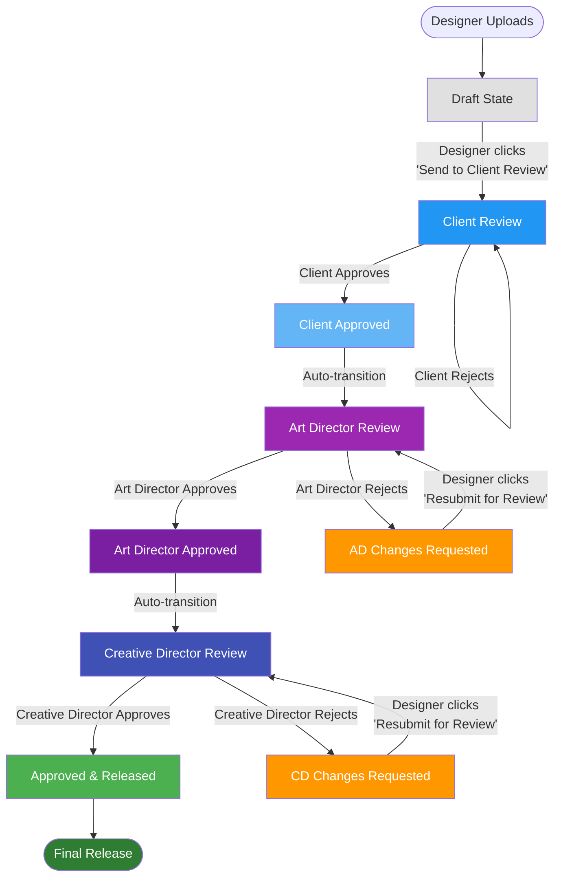

# Approval Workflow Diagram

## Workflow Overview

This document describes the approval workflow implemented in the Client Review application.

## Workflow States

1. **Draft** - Initial state when designer uploads a design
2. **Client Review** - Client is reviewing the design
3. **Art Director Review** - Art Director is reviewing (after client approval)
4. **AD Changes Requested** - Art Director has requested changes
5. **Creative Director Review** - Creative Director is reviewing (after art director approval)
6. **CD Changes Requested** - Creative Director has requested changes
7. **Approved & Released** - Final approval and release

## Workflow Flow Diagram

## Detailed Workflow Steps

### Step 1: Draft State
- **Who**: Designer
- **Action**: Uploads a design file or creates a review from external URL
- **State**: `draft`
- **Next Action**: Designer clicks "Send to Client Review"

### Step 2: Client Review
- **Who**: Client
- **Action**: Reviews the design and provides feedback
- **State**: `client_review`
- **Options**:
  - **Approve**: Moves to Art Director Review (auto-transition)
  - **Reject**: Returns to Client Review for revisions

### Step 3: Art Director Review
- **Who**: Art Director
- **Action**: Reviews the design after client approval
- **State**: `art_director_review`
- **Options**:
  - **Approve**: Moves to Creative Director Review (auto-transition)
  - **Reject**: Moves to "AD Changes Requested" state

### Step 3a: AD Changes Requested
- **Who**: Designer
- **Action**: Designer makes requested changes
- **State**: `ad_changes_requested`
- **Next Action**: Designer clicks "Resubmit for Review" to return to Art Director Review

### Step 4: Creative Director Review
- **Who**: Creative Director
- **Action**: Final review before release
- **State**: `creative_director_review`
- **Options**:
  - **Approve**: Final approval and release
  - **Reject**: Moves to "CD Changes Requested" state

### Step 4a: CD Changes Requested
- **Who**: Designer
- **Action**: Designer makes requested changes
- **State**: `cd_changes_requested`
- **Next Action**: Designer clicks "Resubmit for Review" to return to Creative Director Review

### Step 5: Approved & Released
- **Who**: System
- **Action**: Design is approved and released
- **State**: `approved`
- **Result**: Final approval complete

## Rejection Flow

- **Client Rejection**: Returns to Client Review state
- **Art Director Rejection**: Moves to "AD Changes Requested" state. Designer can make changes and resubmit for Art Director Review.
- **Creative Director Rejection**: Moves to "CD Changes Requested" state. Designer can make changes and resubmit for Creative Director Review.

## Visual Indicators

- **Draft**: Grey badge
- **Client Review**: Blue badge
- **Client Approved**: Light Blue badge
- **Art Director Review**: Purple badge
- **Art Director Approved**: Deep Purple badge
- **AD Changes Requested**: Orange badge
- **Creative Director Review**: Indigo badge
- **CD Changes Requested**: Orange badge
- **Approved & Released**: Green badge

## API Methods

- `moveToClientReview(reviewId)` - Moves from draft to client review
- `approveWorkflowStage(reviewId, stage, user)` - Approves current stage
- `rejectWorkflowStage(reviewId, stage, user, reason)` - Rejects current stage:
  - Art Director rejection → "AD Changes Requested"
  - Creative Director rejection → "CD Changes Requested"
  - Client rejection → returns to Client Review
- `resubmitForReview(reviewId, targetStage)` - Resubmits after changes requested:
  - From "AD Changes Requested" → Art Director Review
  - From "CD Changes Requested" → Creative Director Review

## Role-Based Access

- **Designer**: 
  - Can move from draft to client review
  - Can resubmit from "AD Changes Requested" to Art Director Review
  - Can resubmit from "CD Changes Requested" to Creative Director Review
- **Client**: Can approve/reject in client review stage
- **Art Director**: Can approve/reject in art director review stage
- **Creative Director**: Can approve/reject in creative director review stage

